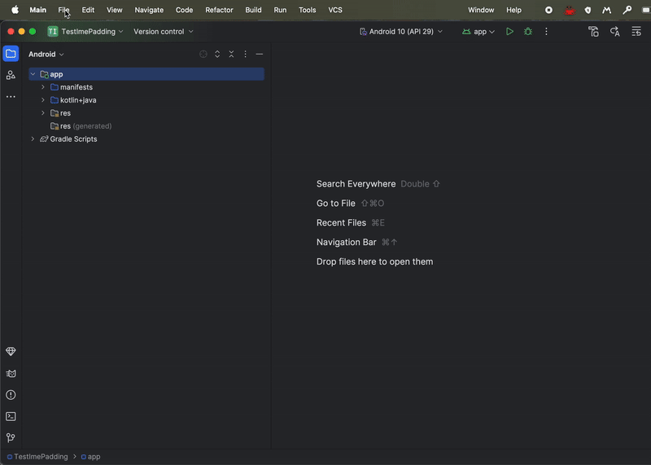

## Плагин для генерации шаблонного кода (Android Studio)

Это плагин для Android Studio, который позволяет генерировать шаблонный код для фичи.

Более подробно, описано тут:
https://shalkoff.ru/posts/android/plugin_code_gen/plugin_codegen/

